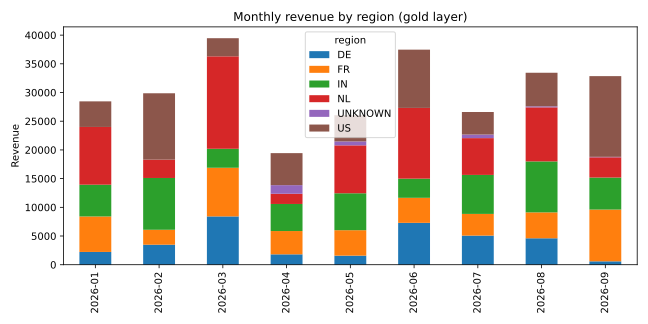
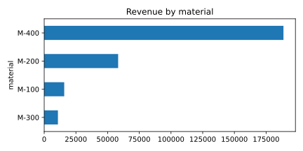

# SAP Sales Medallion Pipeline (PySpark)

A small, runnable Bronze -> Silver -> Gold data pipeline in PySpark, modelled on how a Databricks lakehouse is usually organised. The input is a messy SAP-style sales order extract (duplicates, missing regions, invalid quantities).

## Layers

| Layer | What happens |
|-------|--------------|
| Bronze | Raw CSV ingested as-is, plus load metadata (`_ingested_at`, `_source_file`) |
| Silver | Types cast, duplicates removed by `order_id`, invalid rows rejected, missing region set to `UNKNOWN` |
| Gold | Monthly orders, units and revenue per region, revenue per material with share, month-over-month growth |

## Run it

```bash
pip install -r requirements.txt   # includes pandas and matplotlib for exports and charts
python src/generate_data.py data/sales_raw.csv
python src/pipeline.py data/sales_raw.csv output
cd src && python export_samples.py ../output ../data/samples && cd ..
python src/make_charts.py data/samples docs
pytest -q
```

Needs Java 8/11/17 for Spark.

## Results (sample run, committed in `data/samples/`)

Everything below was produced by the pipeline from `data/sales_raw.csv` (500 synthetic SAP-style orders with injected data problems). The CSV exports of every layer are in the repo, so you can look at the output without running Spark.

### Data quality report (`data/samples/data_quality.csv`)

| Check | Rows |
|-------|------|
| Raw rows | 506 |
| Duplicate rows removed | 6 |
| Invalid quantity rows rejected | 10 |
| Missing region set to UNKNOWN | 8 |
| Silver rows | 490 |

### Revenue





Top material: M-400 with 69.0% of revenue. Best month: 2026-03 (39,460).

## Repository layout

```
data/sales_raw.csv        raw input extract
data/samples/*.csv        bronze, silver, gold, materials, growth, data quality outputs
docs/*.svg                charts generated from the gold layer
src/generate_data.py      synthetic data generator (seeded, reproducible)
src/pipeline.py           bronze / silver / gold transformations + quality report
src/export_samples.py     writes each layer to a CSV
src/make_charts.py        renders the charts
tests/test_pipeline.py    unit tests for the transformations
```

## Running on Databricks

The code uses plain DataFrame APIs. To run it in a workspace, set `FORMAT = "delta"` in `src/pipeline.py`, point the paths at a volume or Unity Catalog location, and use the cluster's existing `spark` session.

## Why this project

Shows the core of a data engineering workflow that SAP BW teams are moving towards: layered data modelling, data quality rules and aggregated reporting tables, with unit tests on the transformation logic.

## Ideas for next steps

- Delta tables with schema enforcement and `MERGE` for incremental loads
- Data quality report per run (rows rejected and why)
- Orchestration with Databricks Workflows
